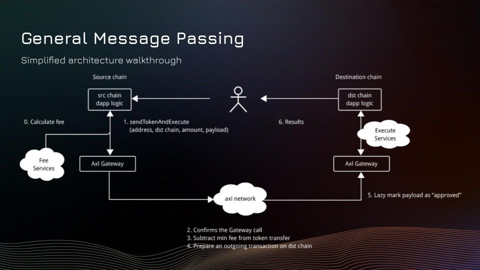

# Adding Cross-Chain NFT Functionality using Axelar


To implement cross-chain support for NFTs using Axelar's GMP (General Message Passing) system in our project, we can follow a similar approach as wedid for Aptos, Flow, Ethereum, and Solana. Here's a step-by-step explanation of how we can integrate cross-chain functionality into your existing codebase:

1) Smart Contracts:

 - Creating a new directory named `contracts` in our project's root directory to store the cross-chain-related smart contracts.
 - Inside the `contracts` directory, create the following Solidity files:
    - `NftLinker.sol`: Implement the main logic for cross-chain NFT transfers, as provided in the previous example. This contract will handle the sending and receiving of NFTs across different chains.
    - `NftLinkerProxy.sol`: Create a proxy contract that acts as an upgradeable interface for the NFT Linker contract, as shown in the previous example.
 - Compile the smart contracts using a Solidity compiler compatible with the Axelar GMP SDK.

2) Chain-Specific Deployment:

- In the `deploy` directory, create separate deployment scripts for each supported chain (e.g., `aptos.deploy.ts`, `flow.deploy.ts`, `ethereum.deploy.ts`, `solana.deploy.ts`).
- In each deployment script, use the `deployUpgradable` function from the Axelar GMP SDK to deploy the `NftLinker` contract with the necessary constructor arguments (Axelar Gateway address and Gas Service address) specific to each chain.
- Deploy the chain-specific NFT contracts (e.g., `ERC721Demo` for Ethereum) using the appropriate deployment functions provided by the respective chain's SDK or library.

3) Cross-Chain Execution:

- Create a new directory named `crosschain` in your project's root directory to store the cross-chain execution logic.
- Inside the `crosschain directory`, create a file named `execute.ts`.
- In execute.ts, implement the execute function that handles the end-to-end process of transferring NFTs across chains, similar to the example provided in the previous prompt.
- The execute function should perform the following steps:
  - Mint an initial NFT on the source chain using the chain-specific NFT contract.
  - Approve the NftLinker contract to transfer the NFT on behalf of the owner.
  - Call the sendNFT function on the source chain's NftLinker contract, specifying the destination chain, recipient address, and other necessary parameters.
  - Wait for the cross-chain message to be processed and the NFT to be minted or transferred on the destination chain.
  - Verify the ownership and metadata of the NFT on the destination chain.

4) Configuration:

- Update the `config.ts` file in your project to include the necessary configurations for cross-chain support, such as the Axelar Gateway addresses, Gas Service addresses, and chain-specific settings.

5) Integration with Existing Codebase:

- Modify the existing scripts (e.g., `generate.ts`, `upload.ts`, `mint.ts`) to include cross-chain functionality as needed.

- For example, in the mint.ts script, you can add an option to specify the destination chain and recipient address when minting an NFT, and then use the execute function from the crosschain directory to initiate the cross-chain transfer.

### Deployment

To deploy the NFT Linker, run the following command:

```bash
npm run deploy evm/nft-linker [local|testnet]
```

The aforementioned command pertains to specifying the intended environment for a project to execute on. It provides the option to choose between local and testnet environments by appending either `local` or `testnet` after the command.

An example of its usage is demonstrated as follows: `npm run deploy evm/nft-linker local` or `npm run deploy evm/nft-linker testnet`.

A single NFT is minted to the deployer (`0xBa86A5719722B02a5D5e388999C25f3333c7A9fb`) on each chain.

## Execution

To execute the NFT Linker example, use the following command:

```bash
npm run execute evm/nft-linker [local|testnet] ${srcChain} ${destChain}
```

**Default Values**:

-   `srcChain` is `Ethreum`.
-   `destChain` is `Tezos`. 

**Note**:

It will fail if an attempt is made to send a duplicate NFT to a chain.

## Example

To deploy the NFT Linker locally and send the NFT originally minted on Ethereum to Tezos:

```bash
npm run deploy evm/nft-linker local
npm run execute evm/nft-linker local "Ethereum" "Tezos"
```

### Axelar's Role:
Axelar is a decentralized protocol that facilitates secure cross-chain communication and asset transfers between different blockchain networks. In the context of NFTs, Axelar enables the seamless bridging of non-fungible tokens across supported chains, allowing for interoperability and expanded functionality.

## Key Components and Their Implementation:

1. NFT Linker Contract (NftLinker.sol):
   - Purpose: The core smart contract responsible for handling cross-chain NFT transfers.
   - Implementation:
     - Inherit from ERC721, AxelarExecutable, and Upgradable contracts.
     - Define state variables to store information about the original NFT, such as the source chain, operator address, token ID, and metadata.
     - Implement the `sendNFT` function to initiate cross-chain NFT transfers. This function should handle both minting new NFTs on the destination chain and transferring existing NFTs.
     - Create internal functions `_sendMintedToken` and `_sendNativeToken` to handle the specific logic for minting and transferring NFTs.
     - Implement the `_execute` function to process incoming cross-chain messages and perform the necessary actions (minting or transferring) on the destination chain.
     - Integrate with the Axelar Gateway and Gas Service to facilitate cross-chain communication and gas payments.

2. ERC721 Demo Contract (ERC721Demo.sol):
   - Purpose: A sample ERC721 NFT contract used for testing and demonstration purposes.
   - Implementation:
     - Inherit from OpenZeppelin's ERC721 and ERC721URIStorage contracts.
     - Implement basic NFT functionality, such as minting tokens with metadata using the `mintWithMetadata` function.
     - Define a constructor that sets the name and symbol of the NFT collection.
     - Implement any additional features or customizations specific to your NFT use case.

3. NFT Linker Proxy Contract (NftLinkerProxy.sol):
   - Purpose: A proxy contract that acts as an upgradeable interface for the NFT Linker contract.
   - Implementation:
     - Inherit from the InitProxy contract provided by the Axelar SDK.
     - Define the `contractId` function to return a unique identifier for the NFT Linker contract.
     - The proxy contract should delegate calls to the underlying NFT Linker implementation contract.

4. Deployment and Setup:
   - Implement a deployment script (index.js) to deploy the NFT Linker and ERC721 Demo contracts on each supported chain.
   - Use the `deployUpgradable` function from the Axelar SDK to deploy the NFT Linker contract with the necessary constructor arguments (Axelar Gateway address and Gas Service address).
   - Deploy the ERC721 Demo contract using the `deployContract` function from the Axelar SDK.
   - Set up the required permissions and configurations for the NFT Linker contract to interact with the Axelar Gateway and Gas Service.

5. Cross-Chain NFT Transfer Execution:
   - Implement the `execute` function in the deployment script to handle the end-to-end process of transferring NFTs across chains.
   - Mint an initial NFT on the source chain using the ERC721 Demo contract's `mintWithMetadata` function.
   - Approve the NFT Linker contract to transfer the NFT on behalf of the owner.
   - Call the `sendNFT` function on the source chain's NFT Linker contract, specifying the destination chain, recipient address, and other necessary parameters.
   - Wait for the cross-chain message to be processed and the NFT to be minted or transferred on the destination chain.
   - Verify the ownership and metadata of the NFT on the destination chain.
   - Implement error handling and event logging to track the progress and status of the cross-chain NFT transfer.

### How it works theoratically:
Axelar's cross-chain NFT implementation relies on its General Message Passing (GMP) system, which allows smart contracts on different chains to communicate with each other. The process involves the following steps:

#### Initiating Transfer:

The user interacts with the source chain's NFT Linker contract to initiate a cross-chain NFT transfer.
The sendNFT function is called, specifying the destination chain, recipient address, and other necessary parameters.

#### Sending Message:
The NFT Linker contract on the source chain constructs a cross-chain message payload containing the NFT metadata, destination chain information, and recipient details.
The message is sent to the Axelar Gateway contract on the source chain using the callContract function.

#### Message Routing:
The Axelar Gateway receives the message and validates its authenticity and integrity.
The message is then routed through the Axelar network, which consists of a set of validators responsible for relaying messages between chains.
The validators reach a consensus on the validity of the message and its intended destination.

#### Execution on Destination Chain:
Once the message reaches the destination chain, it triggers the _execute function in the NFT Linker contract on that chain.
The _execute function verifies the authenticity of the message by checking its origin and the sender's address.

#### Based on the message payload, the NFT Linker contract performs the necessary actions:
If the NFT originates from the source chain, a new NFT is minted on the destination chain using the original metadata.
If the NFT is being transferred back to its original chain, the ownership is updated accordingly.

#### Gas Payment:
Axelar's Gas Service is responsible for handling the payment of gas fees for cross-chain transactions.
The user includes the required gas payment when initiating the NFT transfer on the source chain.
The Gas Service ensures that sufficient gas is available on the destination chain to execute the NFT minting or transfer logic.
